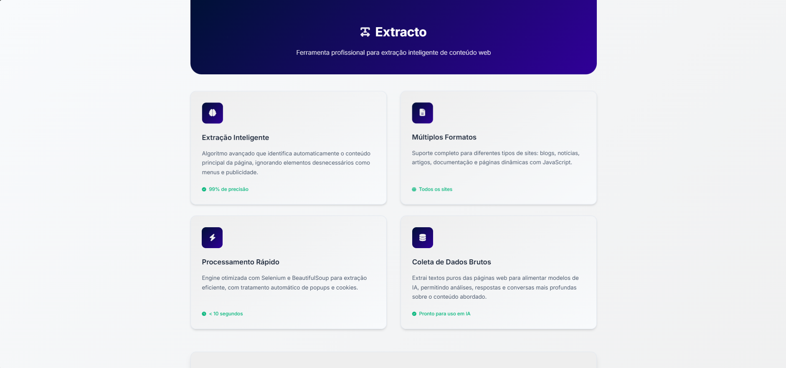

<!-- PORTFOLIO-FEATURED 
 title: Extracto - Extrator Inteligente de Texto
 description: Ferramenta web para extração robusta de texto de páginas (com fallback de renderização), limpeza de anúncios/popup e exportação, pronta para pipelines de ciência de dados. 
 technologies: Python, Flask, BeautifulSoup, Requests, Vercel, HTML, CSS, JavaScript 
 demo: https://extracto-lovat.vercel.app/
 highlight: true 
 image: front-end/foto.png 
 --> 

<p align="center"> 
   
</p>

# 🚀 Extracto — Extrator de Texto Web (foco em Ciência de Dados)

## 📋 Sobre

Backend e frontend para extração inteligente de texto de sites usando **Flask**, **BeautifulSoup** e **Requests**, com fallback gratuito de renderização via Jina Reader e pronto para deploy na **Vercel**. Resultado pensado para alimentar pipelines de **Ciência de Dados** (pré-processamento, sumarização, análise textual).

## 🛠️ Tecnologias

- **Python 3.8+**
- **Flask 2.3.3** - Framework web
- **BeautifulSoup 4.12.2** - Parsing HTML
- **Requests 2.31.0** - Requisições HTTP
- **Requests 2.31.0** - Requisições HTTP
- **Flask-CORS 4.0.0** - Configuração CORS
- **HTML/CSS/JavaScript** - Interface web

## ⚡ Instalação e Execução

### Pré-requisitos
- Python 3.8 ou superior
- pip (gerenciador de pacotes Python)
 

### Executar o projeto

```bash
# 1. Instalar dependências
pip install -r requirements.txt

# 2. Executar o backend
python app.py

# 3. Em outro terminal, servir o frontend (opcional)
python -m http.server 8000 --directory front-end
```

A aplicação estará disponível em:
- Backend: `http://localhost:5000`
- Frontend: `http://localhost:8000`

## 🔗 Endpoints da API

### POST `/extrair`
Extrai texto de uma URL

**Request:**
```json
{
  "url": "https://exemplo.com",
  "filename": "meu_arquivo" // opcional
}
```

**Response:**
```json
{
  "success": true,
  "message": "Texto extraído com sucesso!",
  "filename": "meu_arquivo.txt",
  "content_length": 1234
}
```

### GET `/arquivos`
Lista arquivos no diretório de resultados (mantido para compatibilidade; por padrão, o front usa histórico local)

**Response:**
```json
{
  "success": true,
  "files": [
    {
      "name": "arquivo.txt",
      "size": 1234,
      "lastModified": 1640995200000
    }
  ],
  "count": 1
}
```

### GET `/download/{filename}`
Baixa um arquivo específico

### DELETE `/delete/{filename}`
Deleta um arquivo específico

### POST `/excluir_arquivos`
Exclui arquivos antigos

**Request:**
```json
{
  "days": 7 // arquivos mais antigos que 7 dias
}
```

## 🎯 Funcionalidades

✅ **Extração Inteligente** - Remove automaticamente menus, ads e elementos desnecessários  
✅ **Múltiplos Seletores** - Usa vários seletores CSS para encontrar o conteúdo principal  
✅ **Sanitização** - Limpa e formata o texto extraído  
✅ **Histórico Local** - Armazena extrações recentes no navegador (download sob demanda)  
✅ **CORS Configurado** - Funciona com qualquer frontend  
✅ **Tratamento de Erros** - Respostas consistentes e informativas  

## 🔧 Configurações

Edite o arquivo `app.py` para configurar:

```python
# Porta do servidor (padrão: 5000)
app.run(port=5000, debug=True)

# Configurações CORS (já configurado para desenvolvimento)
CORS(app, resources={
    r"/*": {
        "origins": ["http://localhost:8000", "http://localhost:5000"],
        "methods": ["GET", "POST", "DELETE", "OPTIONS"],
        "allow_headers": ["Content-Type", "Authorization"]
    }
})
```

## 🏗️ Estrutura do Projeto

```
├── app.py                          # Backend principal Flask
├── requirements.txt                # Dependências Python
├── package.json                    # Configurações do projeto
├── vercel.json                     # Configuração para deploy no Vercel
├── front-end/                      # Interface web
│   ├── index.html                  # Página principal
│   ├── script.js                   # Lógica do frontend
│   ├── styles.css                  # Estilos CSS
│   └── favicon.ico                 # Ícone da página
├── resultados/                     # Arquivos extraídos (compatibilidade)
└── .gitignore                      # Arquivos ignorados pelo git
```

## 🧪 Testando

```bash
# Testar extração
curl -X POST http://localhost:5000/extrair \
  -H "Content-Type: application/json" \
  -d '{"url": "https://example.com", "filename": "teste"}'

# Listar arquivos
curl http://localhost:5000/arquivos

# Baixar arquivo
curl -O http://localhost:5000/download/teste.txt
```

## 🚀 Deploy

### Vercel (Recomendado)

```bash
# Instalar Vercel CLI
npm install -g vercel

# Deploy
vercel --prod
```

### Outras plataformas
O projeto pode ser facilmente deployado em qualquer plataforma que suporte Python, como:
- Heroku
- Railway
- DigitalOcean App Platform
- Google Cloud Run

---

**🎉 Pronto!** Seu extrator de texto web em Python está funcionando perfeitamente! Acesse `http://localhost:5000` para começar a usar.
